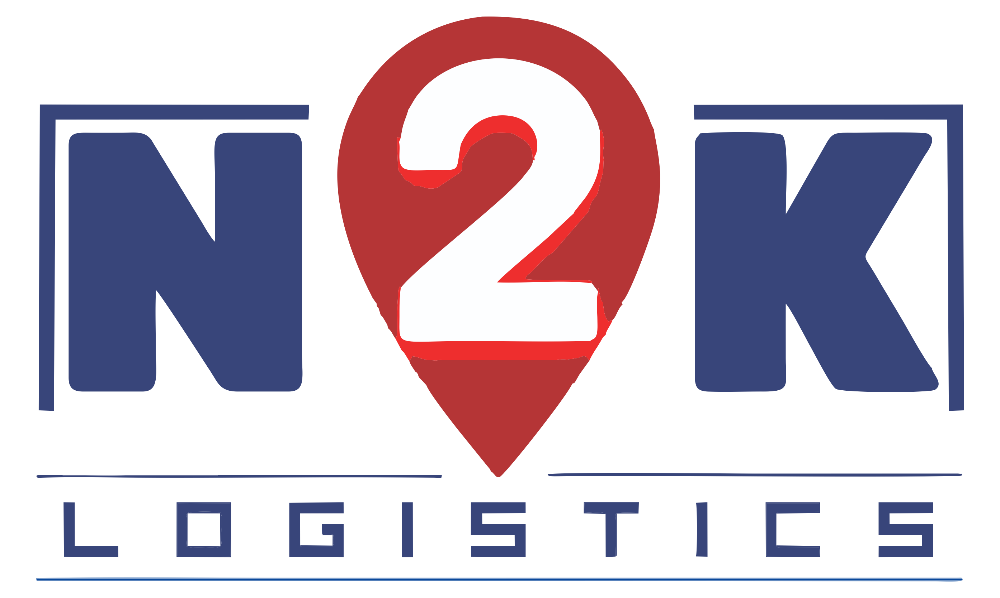

# N2K Logistics Management System

<div align="center">
  
  
  [](https://reactjs.org/)
  [](https://nodejs.org/)
  [](https://expressjs.com/)
  [](https://tailwindcss.com/)
  [](LICENSE)
</div>

## Table of Contents
- [About N2K Logistics](#about-n2k-logistics)
- [Features](#features)
- [Tech Stack](#tech-stack)
- [Project Structure](#project-structure)
- [Installation](#installation)
- [Configuration](#configuration)
- [Usage](#usage)
- [API Documentation](#api-documentation)
- [Screenshots](#screenshots)
- [Contributing](#contributing)
- [License](#license)

## About N2K Logistics

**N2K Logistics** is a comprehensive logistics management platform designed to streamline delivery operations, track shipments, and manage fleet logistics efficiently. Our system provides real-time tracking, automated notifications, and comprehensive reporting for modern logistics operations.

### Mission Statement
To revolutionize logistics management through innovative technology solutions that enhance operational efficiency, improve customer satisfaction, and drive business growth.

### Why Choose N2K Logistics?
- **Real-time Tracking**: Monitor shipments and deliveries in real-time
- **Automated Notifications**: Keep customers informed with SMS and email updates
- **Comprehensive Dashboard**: Admin, driver, and customer portals
- **Fleet Management**: Efficient vehicle and driver allocation
- **Route Optimization**: Smart delivery route planning
- **Financial Tracking**: Complete accounting and billing system

## Features

### Multi-Role Authentication
- **Admin Portal**: Complete system management and oversight
- **Driver Portal**: Mobile-friendly interface for drivers
- **Agent Portal**: Streamlined order management
- **Customer Tracking**: Real-time shipment tracking

### Advanced Dashboard
- Real-time delivery status monitoring
- Interactive charts and analytics
- Performance metrics and KPIs
- Route optimization visualization

### Fleet Management
- Vehicle registration and management
- Driver allocation and scheduling
- Maintenance tracking
- Fuel management

### Communication System
- Automated SMS notifications via Twilio
- Email notifications via EmailJS
- Real-time status updates
- Customer feedback system

### Financial Management
- Order billing and invoicing
- Vehicle accounts and expenses
- Labour management
- Fixed assets tracking

### Delivery Management
- Hub-based delivery allocation
- Delivery point management
- Route optimization
- Proof of delivery

## Tech Stack

### Frontend
- **Framework**: React 18.3.1
- **Build Tool**: Vite 4.3.4
- **Styling**: Tailwind CSS 3.4.1
- **UI Components**: Headless UI, Heroicons
- **Charts**: Chart.js, Recharts
- **Animations**: Framer Motion
- **Icons**: Lucide React, React Icons
- **PDF Generation**: jsPDF, html2canvas
- **State Management**: React Hooks
- **Routing**: React Router DOM 6.22.1
- **Notifications**: React Toastify
- **Particles**: tsparticles

### Backend
- **Runtime**: Node.js
- **Framework**: Express.js 4.21.2
- **Database**: MSSQL, MySQL2
- **Validation**: Joi, Celebrate
- **Security**: Helmet, CORS
- **Logging**: Winston
- **Caching**: Node Cache
- **Environment**: dotenv

### External Services
- **SMS Service**: Twilio
- **Email Service**: EmailJS
- **Database**: Firebase
- **File Processing**: XLSX

### Development Tools
- **Linting**: ESLint 9.17.0
- **CSS Processing**: PostCSS, Autoprefixer
- **Package Manager**: npm
- **Version Control**: Git

## Project Structure

```
N2K_Final/
├── frontend/                    # React frontend application
│   ├── public/                  # Static assets
│   │   ├── N2K_LOGO_SVG.svg    # Company logo
│   │   └── ...
│   ├── src/
│   │   ├── components/          # Reusable UI components
│   │   │   ├── admin/           # Admin-specific components
│   │   │   ├── driver/          # Driver portal components
│   │   │   ├── charts/          # Data visualization
│   │   │   └── tracking/        # Tracking components
│   │   ├── pages/               # Main application pages
│   │   │   ├── AdminDashboard.jsx
│   │   │   ├── DriverPortal.jsx
│   │   │   ├── TrackingPortal.jsx
│   │   │   └── ...
│   │   ├── utils/               # Utility functions
│   │   │   ├── notifications.js # SMS/Email services
│   │   │   ├── hubAllocation.js # Delivery logic
│   │   │   └── ...
│   │   ├── api/                 # API integration
│   │   └── assets/              # Images and media
│   ├── package.json
│   ├── vite.config.js
│   ├── tailwind.config.js
│   └── firebase.json
├── backend/                     # Express.js backend
│   ├── server.js               # Main server file
│   └── package.json
├── dbcreation.txt              # Database schema
├── .gitignore
└── README.md
```

## Installation

### Prerequisites
- Node.js (v16 or higher)
- npm or yarn
- MSSQL/MySQL database
- Firebase account
- Twilio account (for SMS)
- EmailJS account (for emails)

### 1. Clone the Repository
```bash
git clone https://github.com/your-username/n2k-logistics.git
cd n2k-logistics
```

### 2. Install Backend Dependencies
```bash
cd backend
npm install
```

### 3. Install Frontend Dependencies
```bash
cd ../frontend
npm install
```

## ⚙️ Configuration

### 1. Backend Environment Variables
Create a `.env` file in the backend directory:
```env
PORT=3001
DB_HOST=your_database_host
DB_USER=your_database_user
DB_PASSWORD=your_database_password
DB_NAME=n2k_logistics
NODE_ENV=development
```

### 2. Frontend Environment Variables
Create a `.env` file in the frontend directory:
```env
VITE_TWILIO_ACCOUNT_SID=your_twilio_account_sid
VITE_TWILIO_AUTH_TOKEN=your_twilio_auth_token
VITE_FIREBASE_API_KEY=your_firebase_api_key
VITE_FIREBASE_AUTH_DOMAIN=your_firebase_auth_domain
VITE_FIREBASE_PROJECT_ID=your_firebase_project_id
VITE_EMAILJS_SERVICE_ID=your_emailjs_service_id
VITE_EMAILJS_TEMPLATE_ID=your_emailjs_template_id
VITE_EMAILJS_PUBLIC_KEY=your_emailjs_public_key
```

### 3. Database Setup
Run the SQL scripts from `dbcreation.txt` to set up your database schema.

### 4. Firebase Configuration
Update `src/config.js` with your Firebase configuration.

## Usage

### Development Mode

1. **Start the Backend Server**:
```bash
cd backend
npm start
```

2. **Start the Frontend Development Server**:
```bash
cd frontend
npm run dev
```

3. **Access the Application**:
- Frontend: `http://localhost:5173`
- Backend API: `http://localhost:3001`

### Production Build

1. **Build the Frontend**:
```bash
cd frontend
npm run build
```

2. **Preview Production Build**:
```bash
npm run preview
```

## API Documentation

### Authentication Endpoints
- `POST /api/auth/admin` - Admin login
- `POST /api/auth/driver` - Driver login
- `POST /api/auth/agent` - Agent registration

### Order Management
- `GET /api/orders` - Get all orders
- `POST /api/orders` - Create new order
- `PUT /api/orders/:id` - Update order
- `DELETE /api/orders/:id` - Delete order

### Delivery Tracking
- `GET /api/tracking/:orderId` - Track specific order
- `POST /api/delivery/update` - Update delivery status
- `GET /api/delivery/history` - Get delivery history

### Vehicle Management
- `GET /api/vehicles` - Get all vehicles
- `POST /api/vehicles` - Add new vehicle
- `PUT /api/vehicles/:id` - Update vehicle
- `DELETE /api/vehicles/:id` - Remove vehicle

## User Interfaces

### Admin Dashboard
- **Order Management**: Create, update, and track all orders
- **Fleet Overview**: Monitor vehicle status and allocation
- **Driver Management**: Assign drivers and track performance
- **Analytics**: View charts and performance metrics
- **Financial Reports**: Generate billing and expense reports

### Driver Portal
- **Delivery Queue**: View assigned deliveries
- **Route Navigation**: Optimized delivery routes
- **Status Updates**: Update delivery progress
- **Proof of Delivery**: Capture delivery confirmations

### Customer Tracking
- **Real-time Tracking**: Live shipment location
- **Status History**: Complete delivery timeline
- **Notifications**: SMS and email updates
- **Feedback System**: Rate delivery experience

## Key Features Implementation

### Real-time Notifications
```javascript
// SMS notifications via Twilio
export async function sendSMS(phoneNumber, message) {
  // Implementation in utils/notifications.js
}

// Email notifications via EmailJS
export async function sendEmail(orderDetails) {
  // Implementation in utils/notifications.js
}
```

### Hub-based Allocation
```javascript
// Smart delivery allocation
export function allocateDeliveryHub(deliveryLocation) {
  // Implementation in utils/hubAllocation.js
}
```

### Vehicle Management
```javascript
// Optimal vehicle assignment
export function allocateVehicle(orderRequirements) {
  // Implementation in utils/vehicleAllocation.js
}
```

## Contributing

We welcome contributions to the N2K Logistics platform! Please follow these steps:

1. Fork the repository
2. Create a feature branch (`git checkout -b feature/AmazingFeature`)
3. Commit your changes (`git commit -m 'Add some AmazingFeature'`)
4. Push to the branch (`git push origin feature/AmazingFeature`)
5. Open a Pull Request

### Development Guidelines
- Follow React best practices
- Use Tailwind CSS for styling
- Maintain consistent code formatting
- Add comments for complex logic
- Test thoroughly before submitting

## License

This project is licensed under the MIT License - see the [LICENSE](LICENSE) file for details.


## Acknowledgments

- React team for the amazing framework
- Tailwind CSS for the utility-first CSS framework
- Twilio for SMS services
- EmailJS for email integration
- All open-source contributors

---

<div align="center">
  <strong>Made with ❤️ by the N2K Logistics Team</strong>
  <br>
  <sub>Revolutionizing logistics through technology</sub>
</div>
